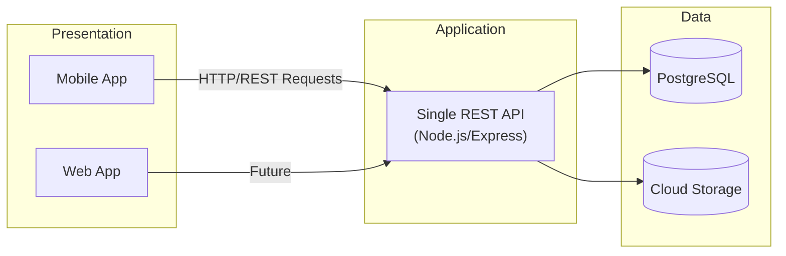
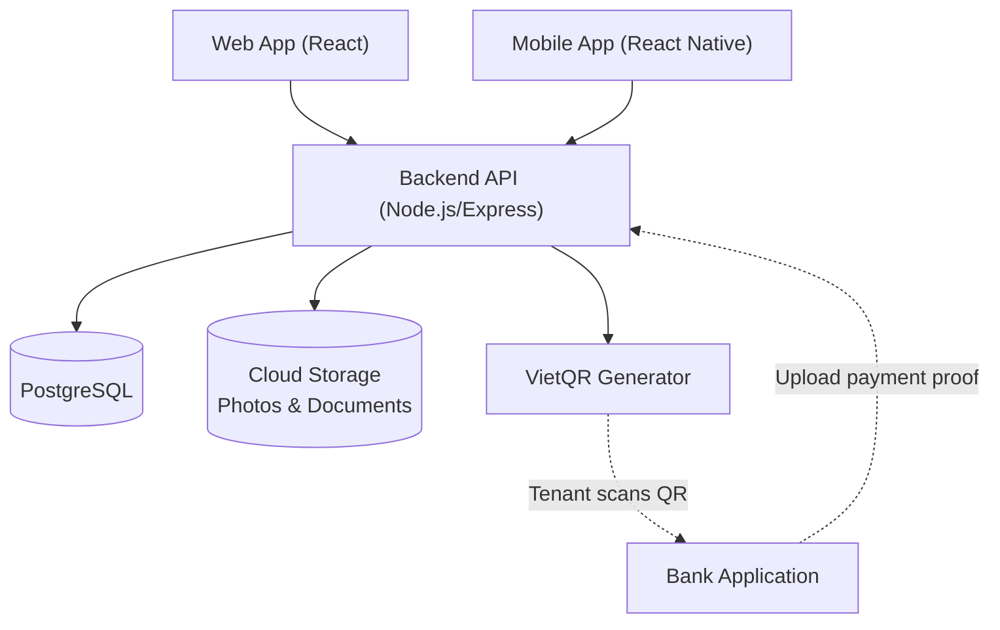

# 🏠 RosiHome

> A modern rental property management platform that helps landlords manage rooms, tenants, billing, payments, and maintenance requests from a single system.

## Overview

RosiHome is a property rental management application designed for small and medium-scale landlords. The platform streamlines daily operations such as tenant management, rent collection, utility billing, QR-based payments, and maintenance request tracking.

The project consists of:

* A mobile application for landlords and tenants
* A centralized backend API
* Cloud-based storage for images and documents
* QR-powered bank transfer payments using the VietQR standard

The system follows a pragmatic architecture optimized for rapid development, maintainability, and deployment by a small engineering team.

---

# Architecture

RosiHome uses a **3-layer client-server architecture** built around a single backend service.

```text
Presentation Layer
        ↓
Application/API Layer
        ↓
Data Layer
```

## Architecture Diagram



### Presentation Layer

Provides the user-facing applications:

* React Native Mobile Application
* React Web Application (future)

Users can:

* Manage properties and rooms
* Track tenants
* View invoices
* Submit maintenance requests
* Upload payment proofs

### Application Layer

A single Node.js/Express backend service responsible for:

* Authentication and authorization
* Business logic
* Invoice generation
* Utility calculations
* QR payment generation
* Maintenance workflows
* File uploads
* API integration

### Data Layer

Persistent storage for:

* Properties
* Rooms
* Tenants
* Leases
* Invoices
* Payments
* Maintenance requests
* Uploaded images and documents

---

# Why a Monolithic Architecture?

For a team of approximately five members working within an 8–10 week development timeline, a monolithic architecture provides significant advantages:

* Faster development
* Simpler deployment
* Easier debugging
* Lower operational complexity
* Reduced infrastructure costs
* No service-to-service communication overhead

Microservices are valuable at large scale but introduce unnecessary complexity for a project of this size.

---

# Why REST Instead of GraphQL?

RosiHome uses REST APIs because:

* Easier learning curve
* Faster implementation
* Better support from scaffolding tools and AI coding assistants
* Sufficient for the project's data requirements
* Simpler testing and debugging

GraphQL's flexibility is not necessary for the current scope of the platform.

---

# Technology Stack

| Layer               | Technology                  |
| ------------------- | --------------------------- |
| Backend             | Node.js + Express           |
| Web Frontend        | React                       |
| Mobile App          | React Native                |
| Database            | PostgreSQL                  |
| ORM                 | Drizzle ORM                 |
| Authentication      | JWT (Passport.js / Auth.js) |
| Storage Platform    | Supabase                    |
| File Storage        | Supabase Storage            |
| Payment Integration | VietQR                      |
| CI/CD               | GitHub Actions              |
| Hosting             | Render / Railway / Vercel   |

---

# System Integration



### Payment Flow

RosiHome never handles or stores user funds.

1. The system generates a VietQR code.
2. The tenant scans the QR code using their banking application.
3. The payment is transferred directly to the landlord's bank account.
4. The tenant uploads a payment proof screenshot.
5. The landlord verifies the payment.

This approach minimizes financial compliance requirements and reduces security risks.

---

# Core Features

## Property Management

* Create and manage properties
* Manage rooms and units
* Track occupancy status

## Tenant Management

* Tenant profiles
* Lease management
* Move-in and move-out tracking

## Billing & Invoicing

* Monthly rent invoices
* Utility cost calculations
* Invoice history

## QR-Based Payments

* VietQR generation
* Payment tracking
* Payment proof uploads

## Maintenance Requests

* Submit maintenance tickets
* Track request status
* Attach supporting images

## Authentication & Security

* JWT authentication
* Role-based access control
* Secure API access

---

# Core Domain Model

```text
Landlord
    │
    ├── Properties
    │       │
    │       └── Units / Rooms
    │                 │
    │                 ├── Lease
    │                 │       │
    │                 │       └── Tenant
    │                 │
    │                 ├── Invoice
    │                 │       │
    │                 │       └── Payment
    │                 │
    │                 └── Maintenance Request
```

---

# Project Structure

```text
rosihome/
│
├── backend/
│   ├── src/
│   ├── drizzle/
│   ├── routes/
│   ├── services/
│   └── middleware/
│
├── web/
│   ├── src/
│   ├── components/
│   ├── pages/
│   └── hooks/
│
├── mobile/
│   ├── src/
│   ├── screens/
│   ├── components/
│   └── services/
│
├── docs/
│
└── .github/
    └── workflows/
```

---

# Development Workflow

```text
Feature Branch
      ↓
Pull Request
      ↓
Code Review
      ↓
GitHub Actions CI
      ↓
Merge to Main
      ↓
Automatic Deployment
```

---

# Future Enhancements

* AI-powered maintenance categorization
* Smart invoice anomaly detection
* Tenant communication center
* Push notifications
* Occupancy analytics dashboard
* Multi-property financial reporting
* Automated payment reconciliation

---

# Team Goals

The primary objective of RosiHome is to provide a practical, production-style software engineering experience while delivering a useful solution for real-world rental property management.

The architecture prioritizes:

* Simplicity
* Maintainability
* Scalability for future growth
* Fast development velocity
* Low operational overhead

---

## License

This project is intended for educational and portfolio purposes.

© RosiHome Team
