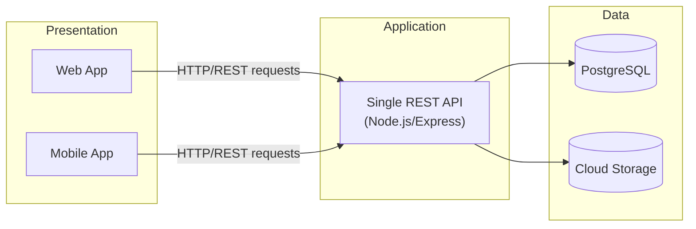
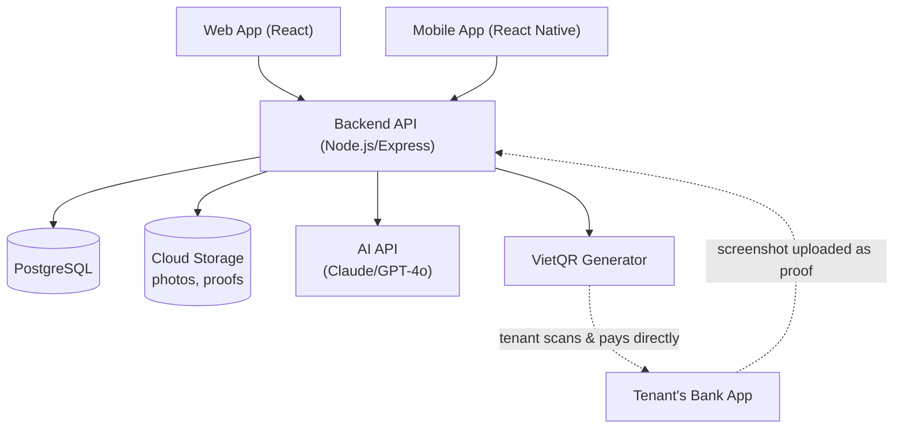

# Technical Architecture — RosiHome

This picks a simple, realistic tech stack for a undergraduate team building an 8–10 week MVP with AI coding assistance.

## 1. Architecture Style
 
RosiHome uses a simple **3-layer client-server architecture**, built as a single (monolithic) backend rather than microservices. For a student team on an 8–10 week timeline, this is a deliberate choice, not a shortcut:
 
| Layer | What's In It | Role |
|---|---|---|
| **Presentation Layer** | Web app (React) + Mobile app (React Native) | What landlords and tenants actually see and use |
| **Application/API Layer** | One backend service (Node.js/Express), exposing a REST API | Handles business logic: billing calculations, QR generation, auth, AI calls |
| **Data Layer** | PostgreSQL (structured data) + Cloud Storage (photos/images) | Stores everything persistently |
 

 
**Why a monolith, not microservices:** microservices add real value at scale (independent scaling, independent deploys, team ownership boundaries) — none of which apply to a 5-person team shipping one product in 8–10 weeks. A single backend is simpler to build, test, deploy, and debug, and it's what a solo QA/DevOps student can realistically operate. Splitting into services now would add coordination overhead the team doesn't have time for, with no real benefit at this scale.
 
**Why REST, not GraphQL:** REST is simpler to learn, simpler for AI coding tools to scaffold correctly, and is more than sufficient for an app of this size — GraphQL's flexibility solves problems (complex nested queries from many different clients) that RosiHome doesn't have.

## 2. Tech Stack

| Layer | Choice | Why |
|---|---|---|
| Backend | **Node.js + Express (or NestJS)** | Same language as the frontend and mobile app — no context-switching; huge AI training coverage means AI agents write it accurately |
| Web frontend | **React** | Most common frontend framework; fastest for AI tools to scaffold |
| Mobile app | **React Native** | Shares the same React knowledge and a lot of code with the web app |
| Database | **PostgreSQL** | Simple, reliable, free-tier hosting available |
| ORM | **Prisma/Drizzle** | Beginner-friendly, AI-tools generate correct Prisma schemas/queries reliably |
| Auth | **JWT (via a library like Passport.js or Auth.js)** | Avoids building security logic from scratch |
| File storage | **Cloud storage (Supabase Storage or S3-compatible)** | Stores meter photos, maintenance photos, payment proof screenshots |
| AI features (runtime) | **Gemini or GPT-4o API** (vision-capable) | Reads meter photos, generates the landlord's weekly summary |
| Payment | **VietQR standard** | Generates a bank-transfer QR code; RosiHome never touches tenant money |
| Testing | **Jest** (unit), **Playwright** (E2E) | Matches the team's testing coursework, JS-native so no extra setup |
| CI/CD | **GitHub Actions** | Free, simple, one student can own it |
| Hosting | **Render / Railway / Vercel** (free/student tiers) | One-click deploy, no dedicated DevOps engineer needed |

## 3. How It Fits Together

The dotted lines matter: money moves directly between the tenant's bank and the landlord's bank. RosiHome only generates the QR code and stores the proof screenshot — it never holds funds.

## 4. Core Data (Simple Version)

- **Landlord** → owns → **Properties** → contain → **Units/Rooms**
- **Unit** → has → **Lease** → linked to → **Tenant**
- **Unit** → generates → **Invoices** (rent + utilities) → settled by → **Payment** (QR + proof)
- **Unit/Tenant** → can raise → **Maintenance Requests**

## 5. AI Usage

| Use | Tool | Purpose |
|---|---|---|
| Writing the code | Claude Code, Codex, Gemini | Used by the team *while building*, speeds up the 8–10 week timeline |
| Running inside the app | Gemini/GPT API | Reads meter photos, writes the weekly landlord summary |

## 6. Why This Stack Works

- One language across backend, web, and mobile — easy for team to build under a deadline.
- Every part of the stack is well-documented and represented in AI training data, which is what actually makes the 8–10 week AI-assisted timeline realistic.
- No payment gateway, no custom auth, no custom ML model — the hard, risky parts are avoided by design.
- Free-tier hosting and tools throughout, matching the budget in estimated budget.