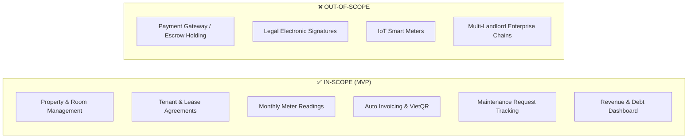

# Software Project Plan — RoSi-Home
## 1. General Information
- **Project:** RoSi-Home — Property management platform for self-managed landlords.
- **Timeline:** 8–10 weeks (Weeks 1–4: Ideation & Scoping; Weeks 5–10: 6 execution weeks).
- **Team Size:** 5 Students (3 Backend, 2 Frontend; part-time ~3–4h/day).
- **Scale:** 51 User Stories (247 Story Points) across 4 Delivery Batches.
- **Tech Stack:** Node.js, Express, PostgreSQL, React Native (Expo), Supabase, Render.
## 2. Project Objectives & Scope
### 2.1. Purpose (Why)
RosiHome is an educational project through which the team applies project management and software development knowledge to a real rental-management problem. The project also aims to deliver a complete, functional MVP that reduces manual billing errors, missed payment and lease deadlines, fragmented records, and overlooked maintenance requests while giving tenants clearer access to rental information.
### 2.2. MVP Objectives (What)
Deliver a complete software solution consisting of two main components:
1. **Mobile Application (React Native/Expo):** Dedicated interfaces for Landlords (property & tenant management) and Tenants (invoices, payment proofs, notifications).
2. **Backend REST API (Node.js/Express/PostgreSQL):** Data persistence, authentication/authorization, utility calculations, dynamic VietQR generation, and PDF reporting.
### 2.3. Scope Boundaries

## 3. Batch Delivery Plan
The 51 User Stories are structured across **3 execution phases**, consisting of **4 sequential Delivery Batches** and **1 final Pilot & Closure phase**:

| Phase & Timeline | Batch | Workstream | Size | Core User Stories | Primary Deliverables |
| :--- | :--- | :--- | :---: | :--- | :--- |
| **Phase 1: Core Foundation** *(Weeks 5–6)* | **Batch 1** | **Foundation** | 68 SP | AUTH (01–06), PROFILE-01, PROPERTY (01–02), ROOM (01–03), UTILITY (01–02), CHARGE-01 | Authentication/JWT, role-based access control, property & room setup, and utility rate configurations. |
| | **Batch 2** | **Core Operations** | 87 SP | TENANT (01–02), LEASE (01–06), METER (01–03), MAINT (01–05) | Tenant profiling, lease agreement lifecycle, monthly utility meter recording, and maintenance tracking. |
| **Phase 2: Advanced Features** *(Weeks 7–9)* | **Batch 3** | **Billing & Payments** | 58 SP | INVOICE (01–04), VIETQR (01–02), PAYMENT (01–03), REMINDER (01–02) | Automated invoice calculation, PDF export, dynamic VietQR generation, payment verification, and payment reminders. |
| | **Batch 4** | **Analytics & Reports**| 34 SP | DASH (01–04), REPORT (01–05) | Visual dashboard (occupancy rate, collected revenue, outstanding debt), and financial PDF reports. |
| **Phase 3: Pilot & Closure** *(Week 10)* | — | **Pilot & Final Release** | — | End-to-End Testing, Production Deployment, Final Presentation | Operational system on Production validated with 2 real landlords and final demo video. |
## 4. Team Organization & Responsibilities
Work is assigned based on each member's technical background and domain ownership:

| Member | Role | Backend Modules & Infrastructure | Mobile Frontend UI Workstream |
| :--- | :--- | :--- | :--- |
| **Chí** | Project Manager / BE1 | • Auth, Profile, Tenant, Lease • Server Infrastructure & Deployment (Render) | — |
| **Đạt** | Developer / BE2 | • Property, Room, Meter readings, Invoices • Backend CI/CD Pipeline (GitHub Actions) | — |
| **Minh** | Developer / BE3 | • Utility rates, Maintenance, VietQR, Payments, Reports • Database & Storage Management (Supabase) | — |
| **Hưng** | Developer / FE1 | — | • Auth, Profile, Property, Room, Tenant, Lease, Invoices, and Dashboard screens |
| **Quân** | Developer / FE2 | — | • Design System & Navigation Architecture • Utility, Meter, Maintenance, VietQR, and Reports screens |
## 5. Schedule & Milestones
### 5.1. Timeline Context & Sashimi Delivery Model
- **Weeks 1–4 (Ideation & Scoping):** Problem research, idea screening, and scope definition (Pivot to RoSi-Home at the end of Week 4).
- **Weeks 5–10 (6 Execution Weeks):** Infrastructure setup, sequential 4-Batch development, and real-world Pilot.
- **Sashimi Overlap Model:** Backend leads Frontend by 1 batch. While Backend builds APIs for Batch $N$, Frontend builds the UI for Batch $N$ using **Mock Data**. Once Backend deploys the APIs, Frontend immediately hooks up real data to minimize idle waiting time.
### 5.2. Key Milestones
| Milestone | Target Window | Phase | Goal & Deliverables | Exit Criteria |
| :--- | :---: | :--- | :--- | :--- |
| **M0** | Weeks 1–4 | **Initiation & Scoping** | Confirm RoSi-Home topic & 51-Story Backlog | Project proposal & Product Backlog formally approved. |
| **M1** | Weeks 5–6 | **Phase 1: Core Foundation** | Complete Batch 1 (Foundation) & Batch 2 (Core Ops) | Auth, Rooms, Tenants, Leases, and Meters running on Mobile. |
| **M2** | Weeks 7–9 | **Phase 2: Advanced Features**| Complete Batch 3 (Billing), Batch 4 (Analytics) & E2E Integration | Automated invoicing, VietQR scanning, and Dashboard/Reports operational; all 51 stories passing test suite. |
| **M3** | Week 10 | **Phase 3: Project Closure & Pilot** | Real-world Pilot and Final Package | Production release deployed; successful trial with 2 landlords; final presentation & demo ready. |
## 6. Execution Process & Quality Gates
For complete technical definitions, coding standards, and lifecycle policies, refer to the Software Process Definition document.
### 6.1. 5-Step Kanban Workflow
Every User Story on Trello flows through 5 standard stages:  
`Ready` $\rightarrow$ `In Progress` *(WIP = 1 task/person)* $\rightarrow$ `Code Review` *(GitHub PR)* $\rightarrow$ `Testing` *(Mobile Verification)* $\rightarrow$ `Done`.
### 6.2. Core Quality Gates
1. **Local Validation:** Developers run local Unit Tests, Linter, and TypeScript compiler checks before opening a PR.
2. **Peer Review:** Every Pull Request requires at least one approval from another team member before merging.
3. **Automated CI Gate (GitHub Actions):** Automatically runs Lint, TypeCheck, Database Migration, Unit Tests, and API Integration Tests on every PR.
4. **Mobile Verification:** Features are verified directly on the Expo mobile app connected to the Backend API.
5. **AI Accountability:** AI-generated code is treated as a draft; the assigned developer assumes 100% responsibility for the logic, security, and defect resolution.
## 7. Project Governance
### 7.1. Risk Register
The authoritative risk register, scores, responses, and status are maintained in the [Risk Management Plan](risk_management.md). Project-plan focus areas are:
- **Schedule:** RP-01 — Academic Workload and Schedule Delay
- **AI accountability:** RP-02 — Over-Reliance on AI Code
- **Scope:** RP-03 — Scope Creep
- **Deployment/service continuity:** RP-11 — Third-Party Services Fail or Block Us
- **Frontend dependency:** RP-09 — Frontend Waiting on Backend
The Project Manager coordinates risk review; assigned owners monitor their areas and apply the documented responses.
### 7.2. Streamlined Change Control
When a change request arises (API adjustments, UI enhancements, or business logic tweaks):
1. **Proposal:** Raised during in-person discussions or directly posted to the team **Messenger** group chat.
2. **Discussion & Consensus:** The team briefly evaluates the impact on scope and schedule; if unanimous consensus is reached, the change is approved and executed.
### 7.3. Tools & Communication Channels
- **Task Management:** Trello (Kanban Board).
- **Source Control & CI/CD:** GitHub, GitHub Actions, Render (API Hosting), Supabase (Database & Storage).
- **Communication Channels:**
  - **In-Person Meetings (Primary):** The primary method for daily coordination, sprint reviews, and architectural alignment.
  - **Messenger:** Daily communication for real-time updates, blockers, and quick change approvals.
  - **Google Meet (Contingency):** Fallback option reserved only for emergency remote discussions when in-person gathering is not feasible.
