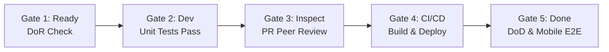

# Software Project Plan 2.0 — RosiHome

## 1. Document Control

| Attribute | Value |
|---|---|
| **Document** | Software Project Plan 2.0 |
| **Project** | RosiHome — Property Management Platform for Self-Managing Landlords |
| **Version** | 2.0 (Calibrated Execution Baseline) |
| **Date** | 24 July 2026 |
| **Planning Horizon** | 8.5 – 10.0 calendar weeks (~42 working days) |
| **Delivery Model** | Kanban with Dependency-Based Delivery Batches |
| **Team** | 5 Software Engineering Students (3 Backend, 2 Frontend, ~3.5 hrs/day/member) |
| **Related Baselines** | `docs/product_backlog_2.0.md`, `docs/project_estimate_2.0.md`, `docs/software_process_definition.md` |

### 1.1 Purpose
This Project Plan defines how the RosiHome MVP is executed, controlled, and delivered. It establishes the operational baseline by specifying:
1. **Work Breakdown & Scope**: 51 User Stories (247 SP) across 4 Delivery Batches.
2. **People & Roles**: Named ownership across 3 Backend and 2 Frontend developers.
3. **Schedule & Milestones**: 10-week calendar timeline with empirical calibration after completing Batches 1 & 2.
4. **Governance Mechanisms**: Risk management, change control, and quality gates.

---

## 2. Project Objectives & Scope Baseline

### 2.1 Objectives
Deliver a fully functional mobile-first property management application that allows self-managing landlords and tenants to:
* Manage properties, rooms, tenant onboarding, and lease lifecycles.
* Record monthly utility meters and automatically calculate billing statements.
* Generate VietQR payment codes and verify payments via proof uploads.
* Submit and track maintenance tickets with image attachments.
* View real-time occupancy/financial dashboards and export PDF business reports.

### 2.2 Scope Boundaries
* **In Scope**: All 51 User Stories in Backlog 2.0, REST API backend (Node.js/Express/PostgreSQL), Mobile app (React Native/Expo), automated CI/CD pipeline, and a 7-day live landlord pilot.
* **Out of Scope**: Merchant payment gateway acquiring, automated banking webhooks, and IoT smart-meter telemetry.

---

## 3. Delivery Method & Workflow

The project applies **Kanban with Dependency-Based Batches**:
* Work items flow continuously through: `Backlog` $\rightarrow$ `Ready (DoR)` $\rightarrow$ `In Development` $\rightarrow$ `Peer Review PR` $\rightarrow$ `CI Test Gate` $\rightarrow$ `Merge & Deploy Staging` $\rightarrow$ `Mobile Integration` $\rightarrow$ `Done (DoD)`.
* **WIP Limit**: Strictly **1 active User Story per developer** to minimize multitasking overhead.
* **Handoff Rule**: Backend leads Frontend by one batch. Frontend builds UI mocks and design systems during backend coding, then integrates with live APIs once backend batch is deployed.

```text
BE Batch 1 (Done) ──► BE Batch 2 (Done) ──► BE Batch 3 (Active) ──► BE Batch 4 (Planned)
      │                     │                     │                     │
      ▼                     ▼                     ▼                     ▼
FE Batch 1 (Done) ──► FE Batch 2 (Done) ──► FE Batch 3 (Active) ──► FE Batch 4 (Planned)
```

---

## 4. Work Breakdown Structure (WBS) & Batch Plans

The 51 User Stories (**247 SP**) are organized into 4 sequential delivery batches based on data domain dependencies:

```text
RosiHome MVP (51 US / 247 SP)
├── Batch 1: Foundation (15 US / 68 SP) — [COMPLETED]
├── Batch 2: Core Operations (16 US / 87 SP) — [COMPLETED]
├── Batch 3: Billing & Payment (11 US / 58 SP) — [IN PROGRESS]
├── Batch 4: Analytics & Reports (9 US / 34 SP) — [PLANNED]
└── Phase 3: System Integration & Pilot (Buffer 10 Days) — [PLANNED]
```

### 4.1 Batch Breakdown & Ownership

| Batch | Scope & User Stories | SP | Primary Outputs | Named Owners | Status |
|---|---|:---:|---|---|:---:|
| **Batch 1: Foundation** | Auth (6 US), Profile (1 US), Property/Room (5 US), Utility (3 US) | 68 | JWT Auth, Role Guard, Room Inventory, Utility Tariffs | BE1 (Chí), BE2 (Đạt), BE3 (Minh), FE1 (Hưng), FE2 (Quân) | **Done** |
| **Batch 2: Core Ops** | Tenant (2 US), Lease (6 US), Meter (3 US), Maintenance (5 US) | 87 | Tenant Onboarding, Lease Lifecycle, Meter Entry, Ticket System | BE1 (Chí), BE2 (Đạt), BE3 (Minh), FE1 (Hưng), FE2 (Quân) | **Done** |
| **Batch 3: Billing & Pay**| Invoice (4 US), VietQR (2 US), Payment/Proof (3 US), Reminder (2 US) | 58 | Auto Billing, VietQR Generator, Proof Upload, Email Reminders | BE2 (Đạt), BE3 (Minh), FE1 (Hưng), FE2 (Quân), BE1 (Review) | **In Progress** |
| **Batch 4: Analytics** | Dashboard (4 US), Financial & Operational Reports (5 US) | 34 | Landlord Dashboard, Revenue Stats, PDF Export Engine | BE1 (Chí), BE2 (Đạt), BE3 (Minh), FE1 (Hưng), FE2 (Quân) | **Planned** |
| **Phase 3: Integration** | E2E Regression, 7-Day Pilot, Bugfix Buffer, Closure Package | — | Verified Candidate, Pilot Sign-off, Final Demo Package | All 5 Team Members | **Planned** |

---

## 5. Schedule & Milestones Baseline

Total duration is **8.5 – 10.0 calendar weeks** (42 working days, calibrated by real velocity $V = 7.75\text{ SP/day}$):

| Timeline | Backend Focus | Frontend Focus | Major Milestone | Status |
|---|---|---|---|:---:|
| **Week 1** | Architecture baseline, Repo setup, Supabase DB, CI/CD pipeline | Expo SDK 57 setup, NativeWind theme, Navigation shell | **M1: Technical Foundation Ready** | ✅ Completed |
| **Weeks 2–3** | Deliver Backend Batch 1 (Auth, Room, Utility) | Deliver Frontend Batch 1 (Auth/Room UI) & Integrate | **M2: Foundation Live on Staging** | ✅ Completed |
| **Weeks 3–5** | Deliver Backend Batch 2 (Lease, Meter, Maintenance) | Deliver Frontend Batch 2 (Lease/Ticket UI) & Integrate | **M3: Core Operations Live (50% MVP)**| ✅ Completed |
| **Weeks 5–7** | Deliver Backend Batch 3 (Invoice, VietQR, Payment) | Deliver Frontend Batch 3 (Billing/Proof UI) & Integrate | **M4: Billing & VietQR Integrated** | 🔄 In Progress |
| **Weeks 7–8** | Deliver Backend Batch 4 (Dashboard, Report, PDF) | Deliver Frontend Batch 4 (Charts/Reports UI) & Integrate| **M5: Full 51 User Stories Deployed** | ⏳ Planned |
| **Week 9** | E2E cross-role regression, Performance tuning | Mobile build preview, Pilot data setup | **M6: Pilot Testing (2 Landlords)** | ⏳ Planned |
| **Week 10** | Bug fixing, Documentation closure, Demo packaging | Mobile demo polish, Final acceptance sign-off | **M7: Final Academic Defense Submission** | ⏳ Planned |

---

## 6. People & Responsibility Matrix (RACI)

### 6.1 Named Module Assignments
* **Chí (PM / BE1)**: Overall project schedule, Auth/Profile, Tenant/Lease, Dashboard 01–02, CI/CD lead.
* **Đạt (BE2)**: Property/Room portfolio, Meter readings, Invoice calculation engine, Dashboard 03–04.
* **Minh (BE3)**: Utility/Charge tariffs, Maintenance tickets, VietQR/Payment settlement, Report engine & PDF.
* **Hưng (FE1)**: Auth/Profile screens, Property/Room UI, Tenant/Lease UI, Invoice/Payment UI, Dashboard screens.
* **Quân (FE2)**: NativeWind Design System, Shared Components, Meter UI, Maintenance UI, VietQR/Proof UI, Reports UI.

### 6.2 RACI Matrix

| Project Activity | Chí (BE1) | Đạt (BE2) | Minh (BE3) | Hưng (FE1) | Quân (FE2) |
|---|:---:|:---:|:---:|:---:|:---:|
| **Requirements & Backlog Refinement** | **A / R** | R | R | R | R |
| **Backend Implementation** | R | R | R | I | I |
| **Frontend Implementation** | I | I | I | R | R |
| **Peer Code Review (PR Inspection)** | R | R | R | R | R |
| **API Contract & Integration Decision** | **A** | R | R | R | R |
| **Release & Cloud Deployment (Render)** | **A / R** | C | C | C | C |
| **Quality Gate & Pilot Verification** | R | R | R | R | **A / R** |
| **Project Documentation Updates** | R | R | R | R | R |

*(**R** = Responsible, **A** = Accountable, **C** = Consulted, **I** = Informed)*

---

## 7. Risk Management Mechanism

The team maintains an active **Risk Register** reviewed at each batch boundary:

| ID | Identified Risk | Prob. | Impact | Risk Owner | Preventive & Mitigation Plan | Current Status |
|:---:|---|:---:|:---:|:---:|---|:---:|
| **R1** | Frontend becomes integration bottleneck | Med | High | Hưng / Quân | BE deploys 1 batch ahead; FE builds UI with mock contracts first. | **Controlled** |
| **R2** | VietQR string generation fails banking app scan | Med | High | Minh | Adopt strict Napas247 EMVCo standard; test early with real banking apps. | **Mitigated** |
| **R3** | AI generates unverified or non-idiomatic code | Med | Med | Story Reviewer | Enforce peer review, mandatory Vitest coverage, and author accountability. | **Active** |
| **R4** | Team member exam/academic workload conflicts | Med | High | Chí (PM) | Part-time pacing (3.5h/day); 2-week Phase 3 buffer accommodates schedule slips. | **Monitored** |
| **R5** | Supabase Storage / Render service limits exceeded | Low | Med | Chí | Store compressed photos only; use free student tiers and isolated configs. | **Controlled** |
| **R6** | Scope creep beyond 51 User Stories | High | High | Chí (PM) | Strict **Scope Freeze** after Week 5; new requests logged for Post-MVP. | **Active** |

---

## 8. Change Control Mechanism

### 8.1 Change Authorization Levels

| Level | Change Type | Example | Approval Authority |
|:---:|---|---|---|
| **Level 1** | Technical Refactoring | Internal helper rewrite with zero API contract change | Assigned Developer + 1 Peer Reviewer |
| **Level 2** | Minor Acceptance Clarification| Adjusting an edge-case validation message | BE/FE Module Owners consensus |
| **Level 3** | Baseline Scope / Schedule Change | Adding/removing a User Story, shifting milestone dates | **Full Team Consensus + Course Supervisor Approval** |

### 8.2 Change Procedure (7 Steps)
1. **Log Request**: Record change reason, affected User Stories, and expected benefit.
2. **Impact Assessment**: Evaluate impact on Story Points, Velocity, Schedule, and Test suites.
3. **Team Review**: Discuss impact during batch sync.
4. **Approval**: Obtain Level 1–3 sign-off.
5. **Update Baselines**: Update `product_backlog_2.0.md` and `project_plan_2.0.md` before coding.
6. **Implementation**: Code on dedicated branch with automated CI checks.
7. **Verification**: Verify deployed change against updated acceptance criteria.

---

## 9. Quality Control & Acceptance Gates

To guarantee robust software delivery, every work item must pass 5 quality gates:



1. **Gate 1 (Definition of Ready - DoR)**: User story has unambiguous acceptance criteria and stable data dependencies.
2. **Gate 2 (Local Validation)**: Author runs TypeScript check, linting, and local Vitest suites.
3. **Gate 3 (Peer Inspection)**: At least one teammate reviews PR for business logic, error handling, and security.
4. **Gate 4 (Automated CI/CD Gate)**: GitHub Actions enforces clean compilation, database migration check, and API integration tests before merging to `main` and deploying to Render staging.
5. **Gate 5 (Definition of Done - DoD)**: Verified on mobile device with real backend data, soft-deletion verified, no high/critical defects.

---

## 10. Communication & Tooling Baseline

* **Daily Sync**: 10-minute async status check via Messenger/Discord (Yesterday, Today, Blockers).
* **Batch Planning & Review**: 45-minute sync at each batch boundary to review completed SP and unblock dependencies.
* **Collaboration Tools**:
  * Project Tracking: **Trello** (Kanban board aligned with 4 Batches).
  * Source Control & CI: **GitHub** (Branch protection, PR reviews, GitHub Actions).
  * Backend & DB Hosting: **Render Cloud** (`/api/v1`) & **Supabase PostgreSQL**.
  * Mobile Build & Preview: **Expo EAS / Expo Go**.
  * AI Tooling: **Claude Code, Gemini CLI, GPT-5.6 Sol** (Author accountability enforced).
