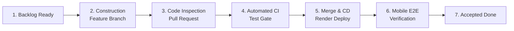

# Software Process Definition — RosiHome

## 1. Document Control

| Attribute | Value |
|---|---|
| **Document Name** | Software Process Definition |
| **Project** | RosiHome — Property Management Platform for Self-Managing Landlords |
| **Version** | 1.0 |
| **Date** | 24 July 2026 |
| **Team** | 5 Software Engineering Students (3 Backend, 2 Frontend) |
| **Timeline** | 8–10 calendar weeks (~45 working days, 3.5 hrs/day/member) |
| **Tech Stack** | Node.js/Express, TypeScript, PostgreSQL (Supabase), Drizzle ORM, React Native (Expo SDK 57), Render Cloud |

---

## 2. SDLC Model Selection & Tailoring

### 2.1 Selected Model
The project adopts an **Iterative and Incremental Development (IID) / Kanban model with Dependency-Based Delivery Batches**.

```text
[Phase 1: Project Initiation & Architecture Baseline] (Week 1)
       │
       ▼
[Phase 2: Overlapping Incremental Construction & Integration] (Weeks 2–8)
       ├── Batch 1 (Foundation): Auth, Profile, Property, Room, Utility
       │      └── [FE UI Mocks & Design System] ──► [FE Batch 1 Live Integration]
       ├── Batch 2 (Core Operations): Tenant, Lease, Meter, Maintenance
       │      └── [FE Batch 2 UI Mocks] ──────────► [FE Batch 2 Live Integration]
       ├── Batch 3 (Billing & Settlement): Invoice, VietQR, Proof, Payment, Reminder
       │      └── [FE Batch 3 UI Mocks] ──────────► [FE Batch 3 Live Integration]
       └── Batch 4 (Analytics & Reporting): Dashboard, Operational & Financial Reports
              └── [FE Batch 4 UI Mocks] ──────────► [FE Batch 4 Live Integration]
       │
       ▼
[Phase 3: System Integration, Verification & Closure] (Weeks 9–10)
```

### 2.2 Tailoring Rationale
1. **AI-Assisted Development Velocity**: With team members utilizing AI coding agents (Claude Code, Gemini), code generation is rapid but completed at irregular intervals. Kanban removes artificial sprint boundaries while maintaining continuous delivery flow.
2. **Strict Domain Data Dependencies**: Rental management operations follow sequential data dependencies (*Property/Room $\rightarrow$ Lease $\rightarrow$ Meter $\rightarrow$ Invoice $\rightarrow$ VietQR $\rightarrow$ Dashboard*). Grouping work into 4 sequential delivery batches prevents architectural rework and integration blockers.
3. **Sashimi / Overlapping Phasing**: Backend development leads Frontend mobile integration by one batch, enabling Frontend developers to prepare UI design systems and mock contracts before real API integration.

---

## 3. SDLCM Elements

| Element | Specification for RosiHome |
|---|---|
| **Phases** | 1. Planning & Technical Setup $\rightarrow$ 2. Incremental Construction (Batches 1–4) $\rightarrow$ 3. System Integration & Pilot. |
| **Activities** | Requirements Analysis, API Design, Coding, Inspection (Peer Review), Automated Testing, Deployment, Acceptance Verification. |
| **Work Products** | Backlog 2.0, Architecture Spec, REST API Endpoints, Mobile APK/Expo Build, Test Suites, User Manual. |
| **Roles** | Project Manager (PM), Backend Developers (BE1, BE2, BE3), Mobile Frontend Developers (FE1, FE2), QA/Tooling Lead. |
| **Standards** | TypeScript Strict Mode, Drizzle ORM Schema Conventions, RESTful API Standard, VietQR Banking Standard. |
| **Practices** | Feature Branching, Pull Request Peer Review, Automated CI Testing Gate, Automated Continuous Deployment (CD). |
| **Templates** | User Story Template (with Acceptance Criteria), PR Description Template, Bug Report Template. |

---

## 4. Phase-by-Phase Process Definition

### Phase 1: Planning, Architecture & Setup (Week 1)
* **Purpose**: Establish project scope, technical baseline, development environment, and CI/CD pipelines.
* **Entry Criteria**: Project Charter and Initial Proposal reviewed and agreed by project team.
* **Inputs**: Problem statement, initial requirements, technology stack selection.
* **Process Flow**:
  1. Define Product Backlog 2.0 (51 User Stories) with testable Acceptance Criteria.
  2. Finalize 3-Layer Monolithic Architecture (Node.js/Express + PostgreSQL + React Native).
  3. Configure GitHub repository, branch protections, and GitHub Actions CI workflow.
  4. Deploy skeleton backend to Render cloud and configure PostgreSQL database on Supabase.
* **Checkpoints**: First automated build passes; backend health check responds at `/api/v1/health`.
* **Outputs**: `product_backlog_2.0.md`, `architecture.md`, `project_plan.md`, initial Git repository with green CI.
* **Exit Criteria**: All 5 members can clone, run locally, pass test suites, and deploy successfully.

---

### Phase 2: Incremental Construction & Integration Batches (Weeks 2–8)

#### Batch 1 – Foundation (Weeks 2–3)
* **Scope**: User authentication, landlord profile, property/room portfolio, utility price configuration.
* **Backend Work**: Authentication, JWT session management, role guards, landlord profile, property/room CRUD, utility tariffs.
* **Frontend Work**: Mobile Design System (NativeWind), Navigation shell, Auth/Profile screens, Property/Room setup UI.
* **Exit Gate**: Working authentication and room inventory deployed to Render staging and functional on mobile.

#### Batch 2 – Core Operational Workflows (Weeks 3–5)
* **Scope**: Tenant onboarding, lease lifecycle management, utility meter reading, maintenance ticketing.
* **Backend Work**: Tenant provisioning, digital lease state machine (active, renewal, termination), monthly meter reading entries, maintenance tickets with Supabase Storage photo attachments.
* **Frontend Work**: Tenant/Lease UI, Meter reading entry, Maintenance request submission & tracking.
* **Exit Gate**: Complete operational cycle functional on mobile (Tenant lease created $\rightarrow$ Meter recorded $\rightarrow$ Issue reported).

#### Batch 3 – Billing, VietQR & Payment Settlement (Weeks 5–7)
* **Scope**: Automatic invoice calculation, VietQR string generation, payment proof upload, manual verification, reminders.
* **Backend Work**: Monthly billing calculation engine (rent + utilities + surcharges), VietQR EMVCo payload generator, payment proof image verification, EmailJS payment reminders.
* **Frontend Work**: Invoice viewer, VietQR display & banking transfer helper, Payment proof photo upload, Landlord verification UI.
* **Exit Gate**: End-to-end billing cycle verified with valid banking app scans and proof validation.

#### Batch 4 – Portfolio Analytics & Reporting (Weeks 7–8)
* **Scope**: Landlord centralized dashboard, financial performance analytics, occupancy statistics, PDF report export.
* **Backend Work**: Dashboard metric aggregations (revenue, debts, occupancy, maintenance), business report calculations, PDF generation adapter.
* **Frontend Work**: Dashboard metric cards, chart visualizations, report filters, and PDF export triggers.
* **Exit Gate**: All 51 User Stories implemented, integrated, and verified on Render staging.

---

### Phase 3: System Integration, Verification & Closure (Weeks 9–10)
* **Purpose**: Execute end-to-end acceptance testing, pilot testing with representative landlords, and prepare final delivery.
* **Entry Criteria**: All 4 delivery batches completed with green CI.
* **Activities**:
  1. Cross-role E2E regression testing (Landlord flow $\longleftrightarrow$ Tenant flow).
  2. Pilot operation with 2 self-managing landlords using simulated real-world room data.
  3. Bug-fixing and performance optimization.
  4. Final documentation packaging (`project_plan.md`, User Manual, Demo Package).
* **Checkpoints**: Zero critical/high defects; 100% CI pass rate; successful pilot sign-off.
* **Outputs**: Deployed production system on Render, compiled Mobile Preview build, Demonstration Package.
* **Exit Criteria**: Formal demonstration and project defense before Course Supervisor.

---

## 5. Story Lifecycle & Working Delivery Flow

Each User Story follows a standardized 7-step quality flow:



1. **Ready**: Story has clear Acceptance Criteria (Gherkin format), assigned owner, and stable schema/API contracts.
2. **Construction**: Developer creates `feature/<story-id>`, implements logic with AI assistance, and writes local unit tests.
3. **Software Inspection (Peer Review)**: Developer opens PR. At least **one other team member** inspects code for logic errors, convention adherence, and security checks.
4. **Automated CI Quality Gate**: GitHub Actions automatically executes:
   - TypeScript compilation check (`tsc --noEmit`).
   - Drizzle database migration check.
   - Unit & API integration tests via Vitest & Supertest.
5. **Merge & Continuous Delivery (CD)**: Upon CI pass and review approval, code merges into `main`. Render automatically builds and deploys the updated backend to staging (`/api/v1`).
6. **Acceptance Verification**: Assigned FE developer tests the feature on mobile connected to the live backend.
7. **Accepted Done**: Story marked `Done` on Trello; documentation updated if contracts changed.

---

## 6. Definition of Ready (DoR)

A User Story enters `Ready` and may begin implementation only when:
- Its intended user persona and business outcome are clear.
- Acceptance criteria are testable and structured in unambiguous format.
- Preceding domain data dependencies (earlier batch APIs and database tables) are deployed and stable.
- Required REST endpoints, request/response contracts, and schema changes are agreed upon.
- Blocking product decisions have been resolved and the assigned developer confirms that the story can be implemented without scope ambiguity.

---

## 7. Engineering Policies & Quality Controls

* **Work-In-Progress (WIP) Limit**: Each developer works on at most **1 Task at a time** (a task can group multiple related User Stories within a feature module) to maximize throughput and minimize multitasking overhead.
* **Git Branching Strategy**:
  - `main`: Protected integration baseline. Direct commits and force pushes are blocked.
  - `feature/<story-id>`: Short-lived feature branches created from `main`.
* **AI Quality Control Policy**: AI-generated code is treated as draft input. The human author remains 100% accountable for explaining code logic, writing unit tests, and verifying security behavior.

