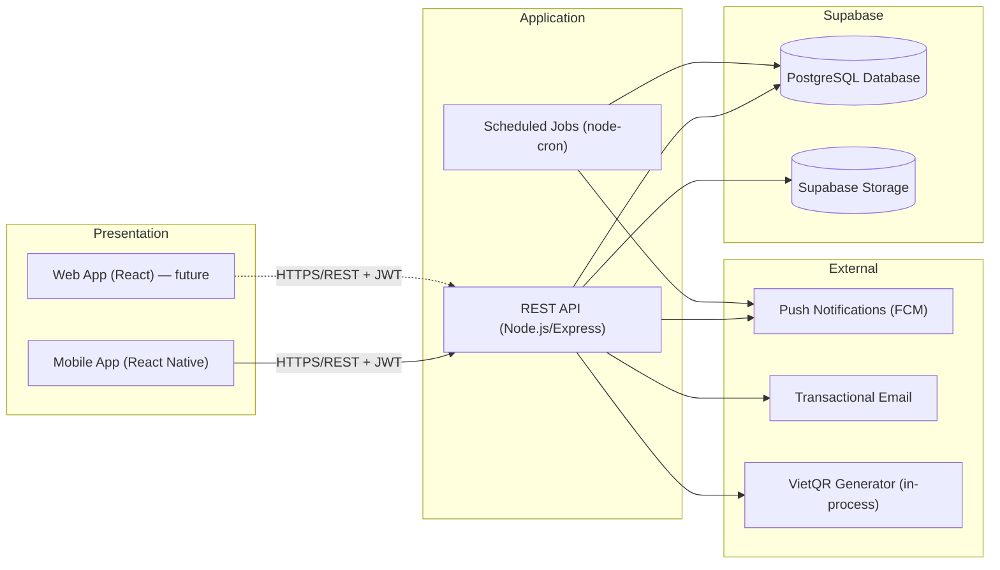
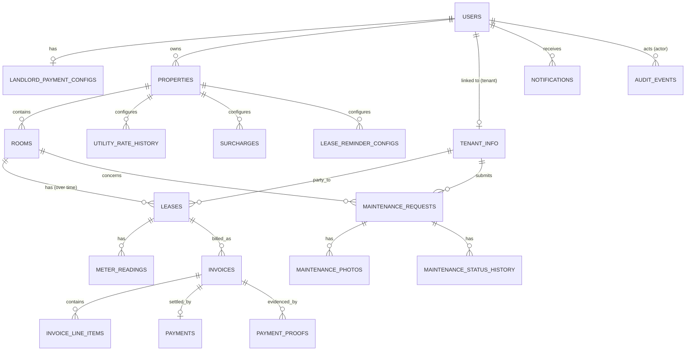

# RosiHome — Architecture & Engineering Conventions

**Audience:** AI coding agents and human developers implementing RosiHome.
**Status:** Approved for implementation. This document is the single source of truth for cross-cutting technical decisions. Feature-level behavior lives in `02-FEATURE-SPECS.md`; do not duplicate business rules here — reference the story ID (e.g. `US-INVOICE-01`) instead.

**How to use this document (for coding agents):** Before implementing any story, read Sections 1–9 once (they apply to every story). Then read the specific feature section in `02-FEATURE-SPECS.md`. Do not invent conventions (error shapes, table names, status enums, rounding, auth checks) that are already defined here — use exactly what is specified so the codebase stays consistent across stories implemented by different agents/sessions.

---

## 1. System Architecture

RosiHome is a **monolithic 3-layer client-server system**: one Node.js/Express REST API backend serving a React web app and a React Native mobile app, backed by PostgreSQL + Supabase Storage. See `architecture.md` (source doc) for the rationale (student team, 8–10 week MVP, no microservices, no GraphQL).

> **Delivery-surface note:** Per PD-07 in the product backlog, the *current* implementation scope is **Mobile only** (React Native). The Web frontend is architected for but not required by any story in this cycle. Do not block backend work on a web client; do not skip mobile-specific rules (push notifications, mobile screens) because "web could do it later."



### 1.1 Tech stack (fixed — do not substitute without updating this doc)

| Concern | Choice |
|---|---|
| Backend runtime | Node.js (LTS) + Express |
| Language | TypeScript (strict mode) |
| ORM | Drizzle ORM |
| Database | PostgreSQL, hosted and managed on **Supabase** (Supabase project = the single database for all environments unless a separate staging project is provisioned) |
| File storage | Supabase Storage (same Supabase project as the database; buckets: `payment-proofs`, `maintenance-photos`) |
| Auth | JWT access token (15 min) + rotating refresh token (7-day sliding); refresh token hashed in `refresh_tokens` table, revoked on logout |
| Scheduled jobs | `node-cron` in-process (no external queue in MVP) |
| Push notifications | Firebase Cloud Messaging (FCM) |
| Transactional email | Gmail SMTP via `nodemailer` (configured through `EMAIL_HOST`/`EMAIL_PORT`/`EMAIL_USER`/`EMAIL_PASSWORD`/`EMAIL_FROM`); sits behind an `EmailProvider` interface so other SMTP providers can be swapped in. On send failure the message is enqueued to `email_send_queue` for retry rather than throwing. |
| PDF generation | `pdfkit` (server-side, no headless browser) |
| QR generation | VietQR EMVCo payload built in-process + `qrcode` npm package to render the PNG/SVG |
| Validation | `zod` schemas shared between route handlers and (optionally) the client |
| Web frontend | React (future) |
| Mobile frontend | React Native (Expo recommended for push-notification and camera/file-picker simplicity) |
| CI/CD | GitHub Actions |
| Hosting | Render/Railway (API server only), **Supabase (Postgres database + file storage)**, EAS/Expo (mobile builds) |

### 1.2 Repository / folder structure

```
/backend
  /src
    /modules
      /auth            # US-AUTH-*, US-PROFILE-01
      /properties       # US-PROPERTY-*, US-ROOM-*
      /tenants          # US-TENANT-*
      /utilities        # US-UTILITY-*, US-CHARGE-01
      /meters           # US-METER-*
      /invoices         # US-INVOICE-*
      /payments         # US-VIETQR-*, US-PAYMENT-*
      /leases           # US-LEASE-*
      /maintenance       # US-MAINT-*
      /dashboard         # US-DASH-*
      /reports           # US-REPORT-*
      /notifications      # cross-cutting push/email delivery
    /jobs               # cron job entry points (one file per job)
    /db
      schema.ts         # Drizzle schema (single source of truth for tables)
      /migrations
      seeds/             # regulatory rate seed data (PD-03)
    /lib                # cross-cutting: jwt, hashing, money, audit, qr, pdf, storage client
    /middleware          # requireAuth, requireRole, requireOwnership, errorHandler, validate(zod)
    app.ts
    server.ts
  /tests
    /unit
    /integration
/mobile                 # React Native app
/web                    # React app (future / stub)
```

Each `modules/<name>` folder follows: `router.ts`, `controller.ts`, `service.ts` (business logic — this is what unit tests target), `repository.ts` (Drizzle queries), `schema.ts` (zod request/response schemas), `types.ts`.

**Rule for agents:** business logic (calculations, validation beyond shape, authorization decisions) belongs in `service.ts`, never in `router.ts`/`controller.ts`. This keeps logic testable without spinning up HTTP.

---

## 2. API Conventions

- Base path: `/api/v1`.
- JSON only. `Content-Type: application/json` except file uploads (`multipart/form-data`).
- Resource-oriented REST; plural nouns; nested resources reflect ownership (e.g. `/properties/:propertyId/rooms`).
- Standard verbs: `GET` (read), `POST` (create/action), `PATCH` (partial update), `DELETE` (soft-delete only — see §6).
- Pagination on all list endpoints: query params `?page=1&pageSize=20` (default 20, max 100); response wraps list in `{ data: [...], meta: { page, pageSize, total } }`.
- Dates: ISO-8601 (`YYYY-MM-DD` for date-only fields like `startDate`; full `YYYY-MM-DDTHH:mm:ssZ` for timestamps). Billing periods use `YYYY-MM`.
- Money: integers, minor-unit-free VND (see §7). Never floats over the wire.

### 2.1 Standard success envelope

```json
{ "data": { ... } }
```
or for lists:
```json
{ "data": [ ... ], "meta": { "page": 1, "pageSize": 20, "total": 57 } }
```

### 2.2 Standard error envelope

```json
{
  "error": {
    "code": "VALIDATION_ERROR",
    "message": "One or more fields are invalid.",
    "fields": [
      { "field": "email", "message": "Email is already registered." }
    ]
  }
}
```

| HTTP status | `code` | Used when |
|---|---|---|
| 400 | `VALIDATION_ERROR` | Request shape/field validation fails (zod) |
| 401 | `UNAUTHENTICATED` | Missing/invalid/expired JWT |
| 403 | `FORBIDDEN` | Authenticated but wrong role or not the owner of the resource |
| 404 | `NOT_FOUND` | Resource doesn't exist **or** exists but belongs to another user (never leak existence — see §5.3) |
| 409 | `CONFLICT` | Uniqueness violation, overlapping lease, duplicate invoice, etc. |
| 422 | `UNPROCESSABLE` | Valid shape, but violates a business rule (e.g. reading lower than previous, invoice not in `Draft`) |
| 500 | `INTERNAL_ERROR` | Unhandled |

**Rule:** never return raw database/ORM error messages, stack traces, or another user's data in any error payload (Global DoD requirement).

---

## 3. Authentication & Authorization

### 3.1 Identity model

- One `users` row = one account = exactly **one role** (`landlord` | `tenant`). A role can never be added to an existing account of the other role (US-AUTH-01, US-TENANT-02).
- **Landlord**: self-registers with email as username (US-AUTH-01).
- **Tenant**: never self-registers. Provisioned automatically when a landlord creates a lease (US-TENANT-02); username = phone number; temporary password emailed.
- `users.mustChangePassword` boolean forces password replacement before any other protected action succeeds (checked in `requireAuth` middleware, not just the client) — enforces US-AUTH-05's "tenant must set new password before accessing other functions."

### 3.2 JWT + Refresh tokens

- **Access token** claims: `{ sub: userId, role: "landlord"|"tenant", mustChangePassword: boolean, iat, exp }`. Do not put PII (email, name) in the token. Expiry: **15 minutes** (`JWT_EXPIRY_SECONDS`, default 900).
- **Refresh token**: an opaque random string (not a JWT), stored hashed (`sha256`) in the `refresh_tokens` table with a **7-day absolute expiry** (`JWT_REFRESH_EXPIRY_SECONDS`, default 604800). The refresh token is **rotated on every use** — when the mobile app presents a refresh token to `POST /api/v1/auth/refresh`, the presented token is immediately revoked and a brand-new access+refresh pair is returned. Because rotation extends the lifetime on each use, a landlord who opens the app at least once every 7 days keeps a live session indefinitely; a user offline longer than 7 days must log in again.
- Token delivered in `Authorization: Bearer <accessToken>` header. Never in query strings (would leak in logs). The refresh token is only ever sent in the body of `/auth/login`, `/auth/refresh`, and `/auth/logout`.
- On logout (US-AUTH-03), the API **revokes the presented refresh token server-side** (sets `revokedAt`); the mobile app must additionally delete both tokens from secure storage and clear any cached protected data from memory/view. (Originally MVP was access-token-only with client-side-only logout; this refresh-token flow replaces that decision.)

### 3.3 Authorization middleware chain

Every protected route composes, in order:
1. `requireAuth` — verifies JWT, loads `req.user = { id, role }`, rejects if `mustChangePassword` is true and the route isn't the change-password route itself.
2. `requireRole('landlord')` or `requireRole('tenant')` — rejects with 403 if role doesn't match.
3. **Ownership check inside the service layer** (not just middleware) — every query that fetches a landlord-scoped resource must filter `WHERE landlordId = req.user.id` (directly or via join); every tenant-scoped resource must filter through the tenant's own `tenantInfoId`/`leaseId`. A resource that exists but belongs to someone else returns `404 NOT_FOUND`, not `403`, so identifier-guessing cannot distinguish "doesn't exist" from "not yours" (US-AUTH-04, US-LEASE-02, US-INVOICE-02, etc. all state this pattern).

**Agent rule:** never trust a `landlordId`/`tenantId`/`propertyId` supplied in a request body to decide ownership. Always derive the owner from `req.user` and re-verify the resource chain in the database (e.g. room → property → `property.landlordId === req.user.id`).

### 3.4 Password policy (applies to US-AUTH-01, US-AUTH-05, US-AUTH-06, US-TENANT-02)

- Minimum 8 characters, at least one letter and one digit.
- Hashed with bcrypt (cost factor 10+). Never stored or logged in plaintext.
- Temporary / recovery passwords (tenant provisioning, password recovery) are cryptographically random, single-purpose, and never written to application logs (use a redaction rule in the logger for any field named `password`, `tempPassword`, `token`). Password recovery (US-AUTH-06) has the backend generate a new random password, store its bcrypt hash, email it to the account's registered address, revoke all outstanding refresh tokens, and force a re-login on all devices — there is no reset-link/token flow.

---

## 4. Cross-Cutting Business Rules

### 4.1 Monetary rounding rule (referenced by every calculation story)

All VND amounts are stored and returned as **integers** (VND has no minor unit). Any calculated amount (consumption × rate, flat × tenant count) is rounded using **round-half-up to the nearest whole VND** before being persisted as a line item. Implement as a single shared function `roundVnd(amount: number): number` in `/lib/money.ts` and use it everywhere — do not re-implement rounding per module.

### 4.2 Billing period

A billing period is the string `YYYY-MM` representing a calendar month. All meter readings, invoices, and reports that reference "the period" use this value for matching/uniqueness (e.g. `UNIQUE(roomId, utilityType, billingPeriod)` on meter readings; `UNIQUE(leaseId, billingPeriod)` on invoices).

### 4.3 Soft deletion & audit (applies to every business entity: properties, rooms, leases, tenant info, utility configs, surcharges, invoices status transitions, maintenance requests)

Per the backlog's global cross-cutting rule (Section 1.5):

- Every soft-deletable table has `deletedAt TIMESTAMPTZ NULL` and `deletedBy UUID NULL REFERENCES users(id)`.
- No API route ever issues a SQL `DELETE`. "Delete"/"archive"/"deactivate" operations set `deletedAt`/`deletedBy` and are exposed as `DELETE /resource/:id` at the API level (REST convention) but implemented as an `UPDATE` in the repository layer.
- All "list"/"get" queries default to `WHERE deletedAt IS NULL` unless the endpoint is explicitly a history/audit view.
- Uniqueness constraints that must not be broken by archived rows use **partial unique indexes** scoped to `deletedAt IS NULL`, e.g.:
  ```sql
  CREATE UNIQUE INDEX rooms_property_name_active
    ON rooms (property_id, name) WHERE deleted_at IS NULL;
  ```
  This lets a landlord reuse a room name after archiving the old room, per the backlog's requirement that archived data must not cause "accidental conflicts."

**Audit events** (separate `audit_events` table, append-only, never updated or deleted):

```
audit_events(
  id, actorUserId, action,            -- e.g. "invoice.sent", "reading.corrected"
  entityType, entityId,
  beforeValue JSONB NULL, afterValue JSONB NULL,
  createdAt
)
```

- Never store passwords, tokens, or full payment-proof binary data in `beforeValue`/`afterValue`.
- Write an audit event inside the same DB transaction as the state change it records (see §4.4) — never as a fire-and-forget side effect that could be lost on failure.
- Every story tagged "records the responsible landlord/user and time" or "records previous/new value" is satisfied by writing to `audit_events`, not by adding ad-hoc `updatedBy` columns to every table (exception: high-traffic status fields like `invoices.sentBy/sentAt` and `leases.endedBy/endedAt` are also denormalized onto the row itself for fast reads, in addition to the audit event).

### 4.4 Transactional integrity

Any operation that touches more than one table as a single logical unit (e.g. lease creation + tenant provisioning + user creation; invoice generation + line items; payment verification + invoice status change) **must** run inside a single Drizzle/Postgres transaction. If any step fails, the whole operation rolls back — this is how "atomic" and "does not create a duplicate account/lease on retry" requirements (US-LEASE-01, US-TENANT-02) are satisfied.

### 4.5 Idempotency for scheduled/repeatable actions

- Invoice generation (US-INVOICE-01): before creating, check for an existing non-deleted invoice with the same `(leaseId, billingPeriod)`; if found, skip. The DB also enforces this via a unique constraint as a second line of defense.
- Reminders (US-REMINDER-01, US-LEASE-05): a `notifications` row (or a dedicated `reminder_log`) keyed by `(subjectType, subjectId, reminderRule, periodKey)` prevents the same reminder firing twice if the cron job re-runs.
- Payment confirmation (US-PAYMENT-02): confirming an already-`Paid` invoice is a no-op that returns the existing payment record rather than creating a second one — enforced by `UNIQUE(invoiceId)` on `payments`.

### 4.6 Status enums (fixed vocabulary — use exactly these string values across API, DB, and UI)

| Entity | Status values |
|---|---|
| Room (derived, not stored) | `Vacant`, `Occupied` |
| Lease | `Active`, `Ended`, `Expired` |
| Invoice | `Draft`, `Sent`, `Paid` |
| Payment proof | `Pending`, `Verified` |
| Maintenance request | `Pending`, `InProgress`, `Completed` |
| Water billing method | `Metered`, `Flat` |
| User role | `Landlord`, `Tenant` |

Room occupancy is **never** a stored column — it is derived at query time (`EXISTS (SELECT 1 FROM leases WHERE roomId = room.id AND status = 'Active' AND deletedAt IS NULL)`), so it can never drift out of sync with the lease it depends on (US-ROOM-02 explicitly forbids directly overriding it).

---

## 5. Data Model

### 5.1 Entity-relationship overview



### 5.2 Table specifications

> Types shown are Postgres types as they'd appear in Drizzle. All tables include `createdAt TIMESTAMPTZ NOT NULL DEFAULT now()`, `updatedAt TIMESTAMPTZ NOT NULL DEFAULT now()` unless noted. Soft-deletable tables additionally include `deletedAt`, `deletedBy` (see §4.3).

**users**
| Column | Type | Notes |
|---|---|---|
| id | uuid PK | |
| role | enum(`Landlord`,`Tenant`) | immutable after creation |
| username | text UNIQUE | email for landlords, phone for tenants |
| passwordHash | text | bcrypt |
| mustChangePassword | boolean default false | true for freshly-provisioned tenants |
| status | enum(`Active`,`Inactive`) default `Active` | |

**landlord_profiles** (1:1 with `users` where role=Landlord)
| Column | Type | Notes |
|---|---|---|
| userId | uuid PK, FK users | |
| fullName | text | |
| email | text UNIQUE | = username for landlords |
| phone | text nullable | |

**landlord_payment_configs** (1:1, US-VIETQR-01)
| Column | Type | Notes |
|---|---|---|
| landlordId | uuid PK, FK users | |
| bankCode | text | VietQR bank BIN/code |
| accountNumber | text | |
| accountHolderName | text | |
| updatedAt | timestamptz | |

**tenant_info** (US-TENANT-01, US-TENANT-02) — *soft-deletable*
| Column | Type | Notes |
|---|---|---|
| id | uuid PK | |
| fullName | text | |
| phone | text UNIQUE (active rows) | = username on provisioned account |
| email | text UNIQUE (active rows) | required, used for credential delivery |
| idNumber | text UNIQUE (active rows) | |
| userId | uuid nullable, FK users UNIQUE | set once account is provisioned |
| createdByLandlordId | uuid, FK users | who created it (via lease flow) |

**properties** (US-PROPERTY-01/02) — *soft-deletable*
| Column | Type | Notes |
|---|---|---|
| id | uuid PK | |
| landlordId | uuid, FK users | |
| name | text | UNIQUE(landlordId, name) active rows |
| address | text | UNIQUE(landlordId, address) active rows |

**rooms** (US-ROOM-01/02/03) — *soft-deletable*
| Column | Type | Notes |
|---|---|---|
| id | uuid PK | |
| propertyId | uuid, FK properties | |
| name | text | UNIQUE(propertyId, name) active rows |
| baseRent | integer (VND) | ≥ 0 |

**utility_rate_history** (US-UTILITY-01/02) — append rows, never update in place; "current" = latest row with `effectiveFrom <= today` and no later row
| Column | Type | Notes |
|---|---|---|
| id | uuid PK | |
| propertyId | uuid, FK properties | |
| electricityRatePerKwh | integer (VND) | |
| waterBillingMethod | enum(`Metered`,`Flat`) | |
| waterRatePerM3 | integer nullable | required if Metered |
| waterFlatAmountPerTenant | integer nullable | required if Flat |
| effectiveFrom | date | |
| createdBy | uuid, FK users | |

**regulatory_rate_defaults** (PD-03, seed data) — read-only reference table
| Column | Type | Notes |
|---|---|---|
| id | uuid PK | |
| utilityType | enum(`Electricity`,`Water`) | |
| locality | text | province/city code |
| method | enum(`Metered`,`Flat`) | |
| ratePerUnit | integer (VND) | |
| sourceReference | text | official document URL/citation |
| effectiveFrom | date | |
| effectiveTo | date nullable | |

**surcharges** (US-CHARGE-01) — *soft-deletable*
| Column | Type | Notes |
|---|---|---|
| id | uuid PK | |
| propertyId | uuid, FK properties | |
| name | text | UNIQUE(propertyId, name, active + overlapping period) |
| monthlyAmount | integer (VND) | ≥ 0 |
| effectiveFrom | date | |
| effectiveTo | date nullable | |
| active | boolean default true | deactivated prospectively without deleting |
| createdBy | uuid, FK users | |

**leases** (US-LEASE-01..06) — *soft-deletable (archival only, not for Ended/Expired)*
| Column | Type | Notes |
|---|---|---|
| id | uuid PK | |
| roomId | uuid, FK rooms | |
| tenantInfoId | uuid, FK tenant_info | |
| startDate | date | |
| endDate | date | planned end; > startDate |
| actualEndDate | date nullable | set when lease is ended early/on schedule |
| agreedRent | integer (VND) | |
| deposit | integer (VND) | |
| status | enum(`Active`,`Ended`,`Expired`) | |
| createdBy | uuid, FK users | |
| endedBy | uuid nullable, FK users | |
| endedAt | timestamptz nullable | |

No two `Active` leases for the same `roomId` may have overlapping `[startDate, endDate]` ranges — enforced at the service layer with an explicit overlap query inside the creation/renewal transaction (Postgres exclusion constraints are an acceptable alternative if the team is comfortable with `btree_gist`).

**lease_reminder_configs** (US-LEASE-05)
| Column | Type | Notes |
|---|---|---|
| propertyId | uuid PK, FK properties | |
| remindAt7Days | boolean default false | |
| remindAt3Days | boolean default false | |
| remindAt1Day | boolean default false | |

**meter_readings** (US-METER-01/02/03)
| Column | Type | Notes |
|---|---|---|
| id | uuid PK | |
| roomId | uuid, FK rooms | |
| utilityType | enum(`Electricity`,`Water`) | |
| billingPeriod | text (`YYYY-MM`) | UNIQUE(roomId, utilityType, billingPeriod) |
| value | numeric | current reading, ≥ 0, ≥ previous reading |
| isInitial | boolean default false | true for the first-ever reading of a room+utility |
| correctionOf | uuid nullable, FK meter_readings(id) | self-reference to the reading this replaces |
| recordedBy | uuid, FK users | |

Corrections (US-METER-03) never overwrite a row; they insert a new row with `correctionOf` pointing at the original, and the original is marked superseded (e.g. `supersededAt`). The "current" reading for a period is the latest non-superseded row.

**invoices** (US-INVOICE-01..04) — *soft-deletable (rare/admin only)*
| Column | Type | Notes |
|---|---|---|
| id | uuid PK | |
| leaseId | uuid, FK leases | |
| roomId | uuid, FK rooms | denormalized for query convenience |
| billingPeriod | text (`YYYY-MM`) | UNIQUE(leaseId, billingPeriod) active rows |
| status | enum(`Draft`,`Sent`,`Paid`) | |
| issueDate | date | |
| dueDate | date | |
| totalAmount | integer (VND) | = sum of line items |
| skipReason | text nullable | populated only on skipped-room log, not on the invoice itself (see US-INVOICE-01 skip log below) |
| sentBy | uuid nullable, FK users | |
| sentAt | timestamptz nullable | |

**invoice_generation_skips** (audit trail for US-INVOICE-01's "skip reason recorded")
| Column | Type | Notes |
|---|---|---|
| id | uuid PK | |
| leaseId | uuid, FK leases | |
| billingPeriod | text | |
| reason | text | e.g. "missing electricity reading" |
| createdAt | timestamptz | |

**invoice_line_items**
| Column | Type | Notes |
|---|---|---|
| id | uuid PK | |
| invoiceId | uuid, FK invoices | |
| type | enum(`Rent`,`Electricity`,`Water`,`Surcharge`) | |
| description | text | e.g. surcharge name, or "Electricity (120 kWh × 3,500₫)" |
| quantity | numeric nullable | consumption or tenant count, when applicable |
| unitRate | integer nullable (VND) | rate/price used, snapshotted |
| amount | integer (VND) | line total, after `roundVnd` |
| sourceRateId | uuid nullable | FK to `utility_rate_history` / `regulatory_rate_defaults` / `surcharges` used, for reproducibility |

**payment_proofs** (US-PAYMENT-01)
| Column | Type | Notes |
|---|---|---|
| id | uuid PK | |
| invoiceId | uuid, FK invoices | |
| tenantInfoId | uuid, FK tenant_info | |
| fileUrl | text | Supabase Storage path |
| status | enum(`Pending`,`Verified`) default `Pending` | |
| uploadedAt | timestamptz | |

**payments** (US-PAYMENT-02) — one row per invoice, ever
| Column | Type | Notes |
|---|---|---|
| id | uuid PK | |
| invoiceId | uuid UNIQUE, FK invoices | |
| proofId | uuid nullable, FK payment_proofs | |
| amount | integer (VND) | = invoice.totalAmount at verification time |
| verifiedBy | uuid, FK users | |
| verifiedAt | timestamptz | |

**maintenance_requests** (US-MAINT-01..05) — *soft-deletable*
| Column | Type | Notes |
|---|---|---|
| id | uuid PK | |
| roomId | uuid, FK rooms | |
| tenantInfoId | uuid, FK tenant_info | requester |
| title | text | |
| description | text | |
| status | enum(`Pending`,`InProgress`,`Completed`) default `Pending` | |
| submittedAt | timestamptz | |
| completedAt | timestamptz nullable | set on transition to `Completed` |

**maintenance_photos**
| Column | Type | Notes |
|---|---|---|
| id | uuid PK | |
| requestId | uuid, FK maintenance_requests | |
| fileUrl | text | max 3 per request, enforced at service layer |

**maintenance_status_history**
| Column | Type | Notes |
|---|---|---|
| id | uuid PK | |
| requestId | uuid, FK maintenance_requests | |
| fromStatus | text | |
| toStatus | text | |
| changedBy | uuid, FK users | |
| changedAt | timestamptz | |

**notifications** (cross-cutting; backs US-REMINDER-*, US-LEASE-05, and every "sends a push notification" acceptance criterion)
| Column | Type | Notes |
|---|---|---|
| id | uuid PK | |
| userId | uuid, FK users | recipient |
| type | text | e.g. `invoice.sent`, `payment.overdue`, `lease.expiring`, `maintenance.statusChanged` |
| title | text | |
| body | text | |
| linkRef | text | deep-link target (e.g. `invoice:{id}`) |
| channel | enum(`Push`) | push-only for MVP (PD-05) |
| deliveryStatus | enum(`Sent`,`Failed`) | |
| dedupeKey | text | e.g. `overdue:{invoiceId}:{YYYY-MM-DD}` — used to enforce §4.5 idempotency |
| createdAt | timestamptz | |

**device_tokens** (technical baseline, not a numbered story but required for push notifications)
| Column | Type | Notes |
|---|---|---|
| id | uuid PK | |
| userId | uuid, FK users | |
| fcmToken | text UNIQUE | |
| platform | enum(`ios`,`android`) | |
| createdAt | timestamptz | |

**audit_events** — see §4.3.

---

## 6. Notification Delivery

Single internal service `NotificationService.send(userId, type, title, body, linkRef, dedupeKey?)`:
1. If `dedupeKey` is provided and a `notifications` row with that key already exists, no-op (idempotency, §4.5).
2. Insert the `notifications` row.
3. Look up the user's `device_tokens`; send via FCM to each; set `deliveryStatus` based on the FCM response.
4. Never throw out of the caller's transaction — notification delivery failures must not roll back the business operation that triggered them (e.g. an invoice must stay `Sent` even if the push fails). Log failures for later inspection.

All "sends a mobile push notification" acceptance criteria call this one service — do not build a second notification pathway.

---

## 7. VietQR Integration

- RosiHome **never** touches or holds money (Assumption in vision doc). It only renders a QR code.
- Payload built server-side per the VietQR (EMVCo QR) spec using: landlord's `bankCode`, `accountNumber`, `accountHolderName` (from `landlord_payment_configs`), the invoice's exact `totalAmount`, and a **deterministic transfer description**: `RH {roomName} {billingPeriod}` (sanitized to the character set VietQR/bank apps accept, no diacritics, max length per spec).
- Render as PNG/SVG server-side (`qrcode` package) or return the raw payload string and let the mobile app render it — either is acceptable; document the choice in the endpoint response (`GET /invoices/:id/vietqr` returns `{ payload, imageUrl }`).
- Before marking US-VIETQR-02 done, validate the payload against at least one real VietQR-compatible banking app or the VietQR public sandbox (see acceptance criteria).
- QR generation/display never changes invoice or payment state (read-only, idempotent, can be called any number of times).

---

## 8. Scheduled Jobs

All jobs live in `/backend/src/jobs`, one file each, registered in `server.ts` via `node-cron`. Each job is also exposed as an internal function callable directly (for tests / manual trigger), not only as a cron callback.

| Job | Schedule | Story | Behavior summary |
|---|---|---|---|
| `generateMonthlyInvoices` | Daily (checks each property's configured billing day) | US-INVOICE-01 | For each active lease whose billing period isn't yet invoiced, checks required readings exist; creates `Draft` invoice + line items, or logs a skip. Idempotent per §4.5. |
| `sendOverdueReminders` | Daily | US-REMINDER-01 | Finds `Sent` invoices past `dueDate` with no `payments` row; sends a deduped push per invoice per day (or per configured frequency). |
| `sendLeaseExpirationReminders` | Daily | US-LEASE-05 | For each property with `lease_reminder_configs`, finds active leases whose `endDate` is exactly 7/3/1 days out (per enabled flags) and notifies landlord + tenant, deduped by `(leaseId, ruleDay)`. |

---

## 9. File Uploads

- Accepted image types: `.png`, `.jpg`, `.jpeg` only, validated by both extension and actual MIME sniffing (not just the client-supplied `Content-Type`).
- Size limits: payment proof ≤ 5 MB (US-PAYMENT-01); maintenance photos use the team-selected limit, recommend 5 MB each, max 3 per request (US-MAINT-01).
- Upload flow: multipart POST to the backend → backend validates → backend streams to the appropriate Supabase Storage bucket → backend stores only the storage path/URL in Postgres, never the binary.
- Access to a stored file is always mediated by the API (short-lived signed URL or an authenticated proxy endpoint) — never a public bucket — so ownership checks (§3.3) apply to file access too.
- Rejected uploads must not leave orphaned files in storage: validate before upload, or delete-on-failure if the storage write happens first.

---

## 10. PDF Generation (US-INVOICE-03, US-REPORT-05)

- Library: `pdfkit`. One generator function per document type: `generateInvoicePdf(invoice)`, `generateReportPdf(report)`.
- Content must mirror exactly what the corresponding JSON/API view shows (billing identity, line items, total, due date, status for invoices; all report metrics for reports) — generate the PDF from the same service-layer data object used for the JSON response, not from a separately re-fetched/re-computed source, to avoid drift.
- PDFs are generated on-demand (not pre-rendered/stored) and streamed back with `Content-Type: application/pdf`.

---

## 11. Testing Strategy

**Deferred.** Automated testing (unit/integration) is out of scope for the current build phase and will be added in a future iteration of this document. Coding agents should **not** scaffold test files, test runners, or CI test steps unless explicitly asked. Structure code so it *remains* testable later (business logic isolated in `service.ts`, no logic embedded in route handlers — see §1.2) even though tests aren't being written now.

---

## 12. Configuration & Environments

- `.env` (never committed) drives: `DATABASE_URL` (Supabase Postgres connection string — pooled connection recommended for the API, direct connection for migrations), `JWT_SECRET`, `SUPABASE_URL`, `SUPABASE_SERVICE_KEY` (used for Supabase Storage access), `FCM_SERVER_KEY`, `EMAIL_PROVIDER_API_KEY`, `NODE_ENV`.
- The Supabase project is the database for every environment: use a **separate Supabase project per environment** (development / staging-integration / production) rather than separate databases within one project, so storage buckets and auth-adjacent settings don't leak across environments.
- Database migrations are managed with Drizzle Kit against the Supabase Postgres instance; every schema change ships as a migration file committed to `/backend/src/db/migrations` and applied via `drizzle-kit push`/`migrate` — never hand-edit the schema through the Supabase dashboard (Global DoD: "reproducible" migrations).